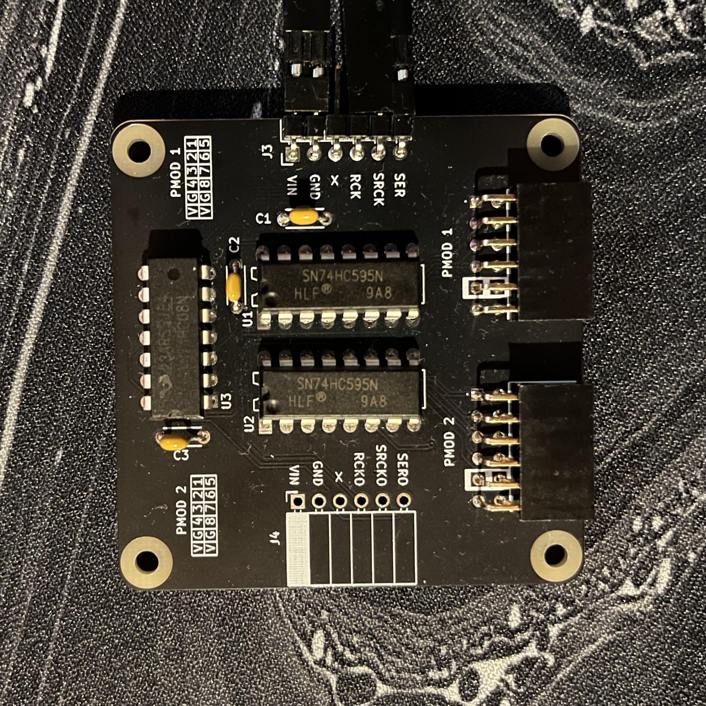
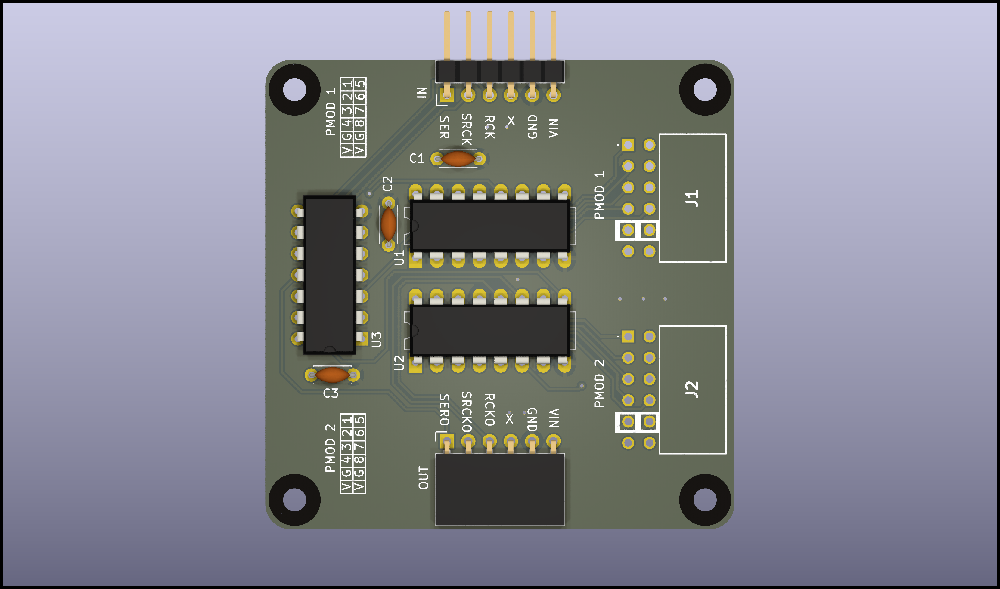

# 74HC595 Shift Register Output Extender

This project uses two serial shift registers (74HC595) and a 74HCT08 quad AND gate as a buffer to ensure stable input and output signal operation. The buffer prevents signal overload on input pins, even when multiple modules are daisy-chained.

Built module 

KiCad render 

### Inputs for the 74HC595 Shift Register:
- **SER**: Serial Data Input  
- **SRCLK**: Shift Register Clock  
- **RCLK**: Register Clock  

### Outputs:
- Two PMOD-compatible connectors  

This setup allows for efficient signal management and easy extension of digital outputs.